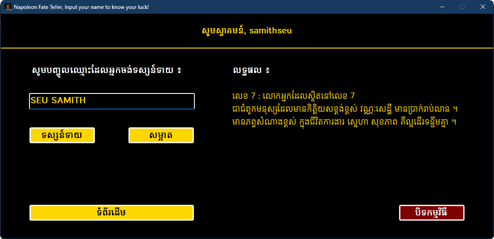

# Napoleon Fate Teller

This repo was created for storing the C# project using Windows Form to make an application telling luck for people by using their names while studying C# Programming I at BTI. The method was referenced from NAPOLEON'S ORACULUM, or BOOK OF FATE. But It tells luck in Khmer.

You can also download the `exe` file to using it directly here. <a href="NapoleonFateTeller/bin/Debug/net6.0-windows/NapoleonFateTeller.exe" >NapoleonFateTeller.exe</a>

### First Screen

### Input Names

### References

- Book: <a href="https://www.amazon.com/Napoleons-Book-Fate-Oraculum/dp/1578988586">NAPOLEON'S ORACULUM, or BOOK OF FATE</a>
- Blog: https://www.knongsrok.com/archives/92950
